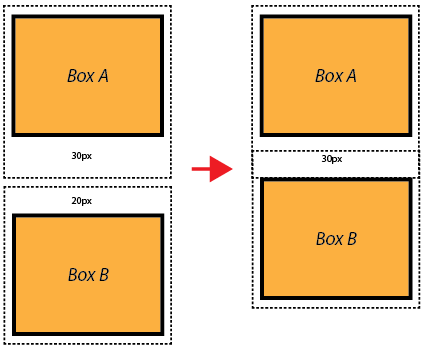

CSS Box Model - Margin, Padding & Borders | Sigma Web Development Course - Tutorial #18

actual height = box height + border top + border bottom + padding top + padding bottom 

box-sizing: border-box ::total height and width is equal to the width or height provided

margin collapse :: margin bar bar nahi lagegi jiski badi hogi uski lagegi

